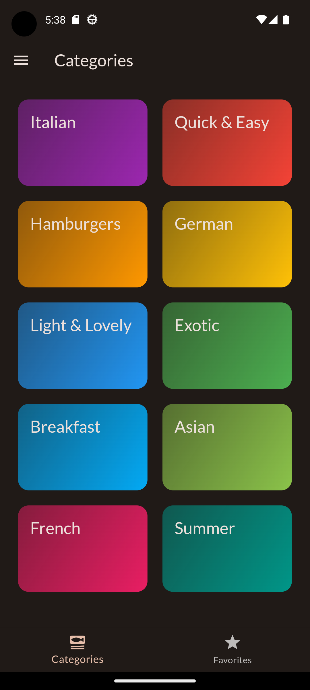
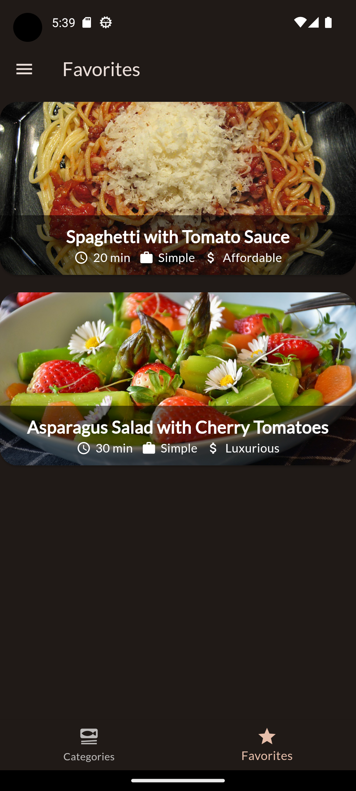
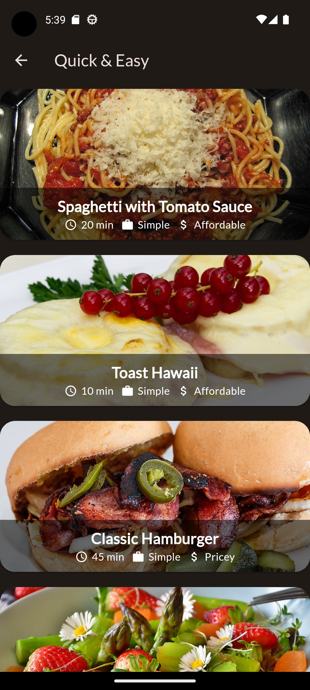
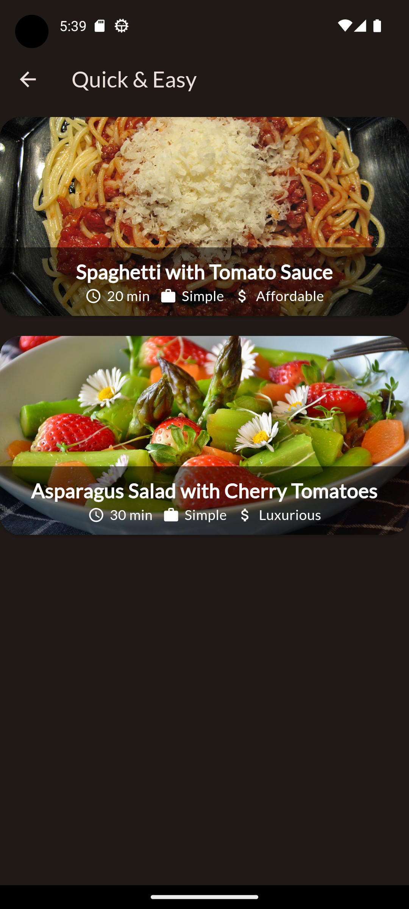
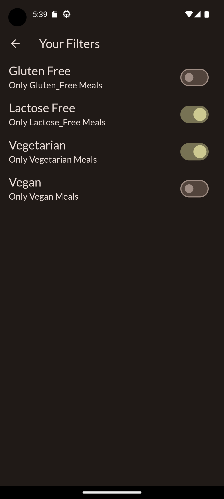
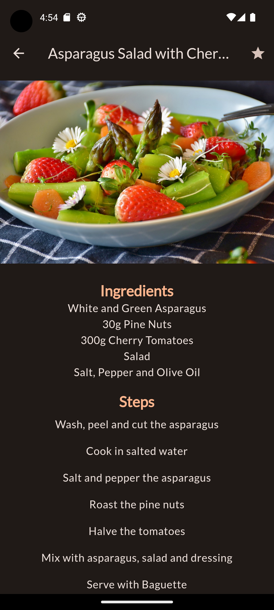

# meals_app

A full functional Flutter Meal Application.

## Description

This project is a Flutter Meals mobile application which gives the user the ability to :

1. view a group of meals which belongs to a specific category that the user has chosen.
2. selecting a specific meal and view its details like Ingredients and Steps.
3. add a specific meal to a favorite list that will be displayed in the favorite screen using the star button in the app bar of the meal.
4. navigate to the filters screen using side drawer.
5. filter the displayed meals in each category based on the filters that has been chosen (the favorite meals wont be affected).

### State Management

State management done using riverpod.

## Features of the app With Screenshots

| Task                   | Screenshot                                                   | Task                       | Screenshot                                                             |
| ---------------------- | ------------------------------------------------------------ | -------------------------- | ---------------------------------------------------------------------- |
| Tabs Navigation Screen |  | Favorite Screen            |               |
| A Category Screen      |   | A Filtered Category Screen |  |
| Filters Screen         |             | Side Drawer                |                     |
